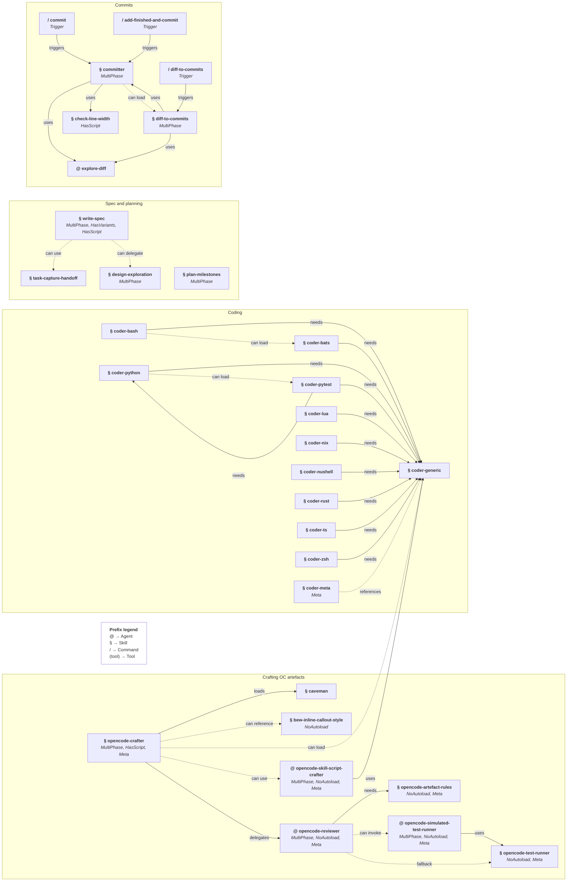
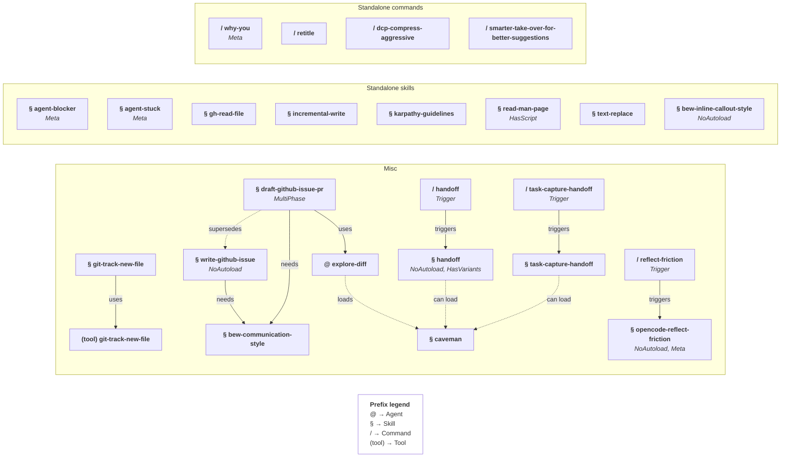

# MY_AI_STUFF

Catalogue of every OpenCode skill, agent, command, and tool in my config, grouped by topic then the rest 🚀

> [!NOTE]
> The catalogue of skills, agents, commands, and tools follows the graphs below.

## Dependency graphs

Complex skills and their direct dependencies first, then the remaining skills and commands.

**Prefix legend**:
- `@` → Agent
- `§` → Skill
- `/` → Command
- `(tool)` → Tool

**Tag legend**:
- `MultiPhase` → defines named sequential phases (implies `Interactive`).
- `Interactive` → non-`MultiPhase` artefact that asks the user questions in its normal workflow.
- `Meta` → artefact exclusively about reflecting on the model's own work, or about editing/planning/authoring OC artefacts.
- `Trigger` → command that triggers a skill/agent.
- `NoAutoload` → never loaded by description matching; explicit or external invocation only.
  Skills/agents/tools without `NoAutoload` are `CanAutoload` by default (no such tag needed).
- `HasVariants` → ships named variants.
- `HasScript` → ships a script under `scripts/`.

### Complex skills

### Remaining skills and commands

## Crafting OC artefacts

- Skill [`opencode-crafter`](./skills/opencode-crafter/) (*MultiPhase, HasScript, Meta*) — Creates, updates, and refactors any OC artefact: skills, agents, commands, oc-tools, oc-plugins.

  - Full lifecycle: Classify → Discover → Draft → (Scripts) → Review → Ship, then (PropagateChange) when variants exist.
  - Delegates review to `opencode-reviewer` and script drafting to `opencode-skill-script-crafter`.
  - Pulls in `coder-generic` + a matching `coder-*` skill for script writing as needed.
  - Can derive a standalone (single-file, tool-less) skill variant on request.
  - Can take inspiration from an existing skill (e.g. from a GitHub URL).

- Agent [`opencode-reviewer`](./agents/opencode-reviewer.md) (*MultiPhase, NoAutoload, Meta*) — Refines a draft OC artefact through focused user feedback; applies trivial edits directly and iterates with user on the rest.

  Invoked by `opencode-crafter` at `Phase:Review` to find gaps and iterate with the user.

- Skill [`opencode-artefact-rules`](./skills/opencode-artefact-rules/) (*NoAutoload, Meta*) — Quality criteria and review checklist for OC artefacts, one reference per type.

  Used for `opencode-reviewer`'s `Phase:Review` — the reviewer loads it to check every criterion for the artefact type.

- Agent [`opencode-simulated-test-runner`](./agents/opencode-simulated-test-runner.md) (*MultiPhase, NoAutoload, Meta*) — Runs an isolated simulated test on a draft artefact.

  Invoked by `opencode-reviewer` at `Phase:Testing` (structural changes only), with no prior review context.

- Skill [`opencode-test-runner`](./skills/opencode-test-runner/) (*NoAutoload, Meta*) — Dry-run testing instructions: generate test cases, narrate them, iterate with reviewer on failures.

  Used for `opencode-simulated-test-runner`'s test pass (entered from `opencode-reviewer`'s `Phase:Testing`) — runs isolated simulated tests on a draft.

- Agent [`opencode-skill-script-crafter`](./agents/opencode-skill-script-crafter.md) (*MultiPhase, NoAutoload, Meta*) — Drafts, tests, and iterates on a skill's scripts.

  Invoked by `opencode-crafter` at `Phase:Scripts` (when needed) to POC and harden scripts in isolation.

## Coding

- Skill [`coder-generic`](./skills/coder-generic/) — General code rules for any language: structure, naming, types, comments, error handling.

  - Splits into `module-rules.md` (imported code) and `script-rules.md` (standalone executables).
  - Loaded before any language skill; every `coder-<lang>` requires it.

- Skills by language/tech: [`coder-bash`](./skills/coder-bash/), [`coder-bats`](./skills/coder-bats/), [`coder-python`](./skills/coder-python/), [`coder-pytest`](./skills/coder-pytest/), [`coder-lua`](./skills/coder-lua/), [`coder-nix`](./skills/coder-nix/), [`coder-nushell`](./skills/coder-nushell/), [`coder-rust`](./skills/coder-rust/), [`coder-ts`](./skills/coder-ts/), [`coder-zsh`](./skills/coder-zsh/).

- Skill [`coder-meta`](./skills/coder-meta/) (*Meta*) — Rules for writing new `coder-<lang>` skills.

## Specs & planning

- Skill [`write-spec`](./skills/write-spec/) (*MultiPhase, HasVariants, HasScript*) — Interactive methodology for drafting and refining specs, design docs, architecture notes, RFCs.

  - Phases: Discover → Explore (optional) → Draft → Review.
  - Delegates deep, pre-spec design maturation to `design-exploration`.

  Variants:
  * [`write-spec-noninteractive`](./skills/write-spec-noninteractive/) (*MultiPhase, NoAutoload*) — non-interactive pass for tool-less chat contexts; no phase gates, questions batched at the end.
  * [`write-spec-noninteractive-standalone`](./skills/write-spec-noninteractive-standalone/) (*MultiPhase, NoAutoload*) — self-contained (inlined) variant of the non-interactive one.

- Skill [`design-exploration`](./skills/design-exploration/) (*MultiPhase*) — Methodology for maturing a design before a spec exists.

  - Phases: Setup → Explore → Wrap.
  - Runs in single-topic or multi-topic mode.

  Used for `write-spec`'s optional `Phase:Explore` when the design is genuinely uncertain.

- Skill [`plan-milestones`](./skills/plan-milestones/) (*MultiPhase*) — Plans, creates, and refines project milestones (`MILESTONES.md`).

  - Phases: Discover → Draft → Discuss → Finalize.

## Commits

- Skill [`committer`](./skills/committer/) (*MultiPhase*) — Drafts a commit message from a diff, with interactive refinement with user.

  - Phases: Setup → Analyse → Style → Draft → Commit.
  - Routes diff analysis through `explore-diff`; wraps with `check-line-width`.
  - Iterates the message with user, offering subject/body refinement suggestions.

- Skill [`diff-to-commits`](./skills/diff-to-commits/) (*MultiPhase*) — Interactive process to splits a diff (default to unstaged changes) into logical commits and drafts each message with user, one group at a time.

  - Phases: Explore → Group → Draft → Summary.
  - Uses `explore-diff` for analysis, then the `committer` skill for each message.

- Skill [`check-line-width`](./skills/check-line-width/) (*HasScript*) — Checks line length / column overflow from a file or stdin; the only authority on wrapping.

  Used explicitly by `committer` to validate message wrapping, and relied on implicitly by `opencode-crafter` / `opencode-reviewer` when writing or reviewing artefacts (via `coder-generic`'s line-width rule).

- Agent [`explore-diff`](./agents/explore-diff.md) — Generic diff/patch explorer; defaults to a summary of concerns, but can be driven to return any structure the caller asks for.

  Used explicitly by `committer` (`Phase:Analyse`) and `diff-to-commits` (`Phase:Explore`) to analyse a diff without polluting shared context.

- Command [`/commit`](./commands/commit.md) — **triggers `committer`**.
- Command [`/bew-commit`](./commands/bew-commit.md) — Alias of `/commit`, useful for repos where `/commit` is hijacked.
- Command [`/add-finished-and-commit`](./commands/add-finished-and-commit.md) — **triggers `committer`**: draft a commit for the task just finished, scoped to its files.
- Command [`/diff-to-commits`](./commands/diff-to-commits.md) — **triggers `diff-to-commits`**.

## Handoff & session

- Skill [`handoff`](./skills/handoff/) (*NoAutoload, HasVariants*) — Produces a structured handoff document from the session so another agent or human can continue in a fresh session.

  Variants:
  * [`handoff-standalone`](./skills/handoff-standalone/) — self-contained, tool-less variant; skill refs become plain recommendations.

- Command [`/handoff`](./commands/handoff.md) — **triggers `handoff`**.

- Skill [`opencode-reflect-friction`](./skills/opencode-reflect-friction/) (*NoAutoload, Meta*) — Reviews session friction (main conversation + subagents) and suggests artefact improvements; only on explicit request.

- Command [`/reflect-friction`](./commands/reflect-friction.md) — **triggers `opencode-reflect-friction`**.

- Skill [`task-capture-handoff`](./skills/task-capture-handoff/) — Captures one deferred, explicitly-named task from the session as a small `TASK-*` note for a future user or agent to pick up.

- Command [`/task-capture-handoff`](./commands/task-capture-handoff.md) — **triggers `task-capture-handoff`**.

## Writing & issues

- Skill [`bew-communication-style`](./skills/bew-communication-style/) — Style reference for writing prose in bew's voice (PRs, issues, posts, emails, chat).
- Skill [`bew-inline-callout-style`](./skills/bew-inline-callout-style/) (*NoAutoload*) — Convention for inline callout markers in prose and artefact files; reference-only.
- Skill [`draft-github-issue-pr`](./skills/draft-github-issue-pr/) (*MultiPhase*) — Drafts GitHub issues and PRs, conforming to the target repo's templates and guidelines in bew's voice.

  - Phases: Classify → ContribGuidelines → PreDraft → Draft → VerifyClaims → (IssueFirst) → Submit.
  - Layers the repo's required template/guideline items over the personal shapes (`for-pr` / `for-issue-feature` / `for-issue-bug`).
  - PR-centric: drafts an issue just-in-time only when the repo requires one before a PR.
  - Uses `bew-communication-style` for voice; delegates diff analysis to `explore-diff`.

- Skill [`write-github-issue`](./skills/write-github-issue/) (*NoAutoload*) — Legacy issue-only drafter, kept for comparison; superseded by `draft-github-issue-pr`.

  Uses `bew-communication-style` for voice and tone. Auto-trigger removed from its description.

- Skill [`caveman`](./skills/caveman/) — Compressed communication mode; ~75% fewer tokens, full technical accuracy.

## Miscellaneous

- Skill [`agent-blocker`](./skills/agent-blocker/) (*Meta*) — Load on environment/runtime hard errors (missing command, version mismatch, permission/auth failure, unreachable network, independently broken tests, failed tool/subagent launch).
- Skill [`agent-stuck`](./skills/agent-stuck/) (*Meta*) — Load when a human decision or strategy change is needed; track consecutive identical failures, load at the third.
- Skill [`gh-read-file`](./skills/gh-read-file/) — Read one explicitly referenced file from GitHub via the authenticated `gh` CLI.
- Skill [`git-track-new-file`](./skills/git-track-new-file/) — Load right after creating a file/dir so the `git_track_new_file` tool git-tracks it; companion to the local `git-track-new-file` tool.
- Skill [`incremental-write`](./skills/incremental-write/) — Write structured files incrementally: skeleton first, then targeted edits per section.
- Skill [`karpathy-guidelines`](./skills/karpathy-guidelines/) — Behavioral guidelines to avoid overcomplication, keep changes surgical, surface assumptions.
- Skill [`read-man-page`](./skills/read-man-page/) (*HasScript*) — Token-efficient incremental man page reading via its `manq` script.
- Skill [`text-replace`](./skills/text-replace/) — Bulk/mechanical search & replace and renames across files using `sd`; supports literal or regex.
- Command [`/why-you`](./commands/why-you.md) (*Meta*) — Reflect on the root cause of a decision, without acting.
- Command [`/retitle`](./commands/retitle.md) — Auto-retitle the current session from the conversation.
- Command [`/dcp-compress-aggressive`](./commands/dcp-compress-aggressive.md) — Aggressively shrink context by collapsing blocks into one lean summary.
- Command [`/smarter-take-over-for-better-suggestions`](./commands/smarter-take-over-for-better-suggestions.md) — A smarter model takes over after a weaker model's suggestions.

## Tools & Plugins

- Tool [`git-track-new-file`](./plugins/git-track-new-file/) — Local plugin registering the `git_track_new_file` tool; runs `git add -N` on new files/dirs, skipping gitignored paths, secrets, and `/tmp`.

  Companion skill `git-track-new-file` tells the agent when to call it.

- Tool [`ui-tester`](./plugins/ui-tester/) — Local TUI playground plugin; `/ui-tester` arms it and shows a settings panel that toggles a bright debug widget into every published UI slot.

  TUI entry `tui.tsx` exercises the slot API. The panel is one component on two surfaces — docked (host session panel) or floating (`app`-slot overlay, `alt+f`), both with background-coloured camera corner marks. While shown it pushes an input mode so the prompt stops receiving typing. Placement is one of `append`, `prepend`, `before`, `after`, `replace`.

- Tool [`account-switcher`](./plugins/account-switcher/) — Local TUI plugin; shows the active account per integration in the prompt footer and home screen, and clicking opens a picker that switches the active credential.

  Reads `CredentialEntry.label` (never the secret); refreshes on `credential.updated`, `credential.switched`, and `integration.updated`.

### Important third-party plugins

- `@tarquinen/opencode-dcp` — Dynamic Context Pruning: manages context dynamically to optimize tokens for long sessions (smarter than simple summarization).
- `opencode-snippets` — In-prompt hashtag-based snippet expansion (e.g. `#editedstuff`); used heavily!

## Repo-specific artefacts

Artefacts scoped to this dotfiles repo (under `<repo>/.agents/skills/`), for my configs! 🙃

### For Neovim

- Skill [`coder-lua-for-nvim`](../.agents/skills/coder-lua-for-nvim/) — Neovim Lua conventions for this repo's `nvim/lua/**`; requires `coder-generic` + `coder-lua`.
- Skill [`nvim-plugin-dev`](../.agents/skills/nvim-plugin-dev/) (*HasScript*) — Neovim plugin authoring under `nvim-myplugins/`; requires `coder-generic`, `coder-lua`, `coder-lua-for-nvim`.
- Skill [`read-nvim-help`](../.agents/skills/read-nvim-help/) (*HasScript*) — Token-efficient incremental Neovim/Vim help reading via its `nvimq` script.
