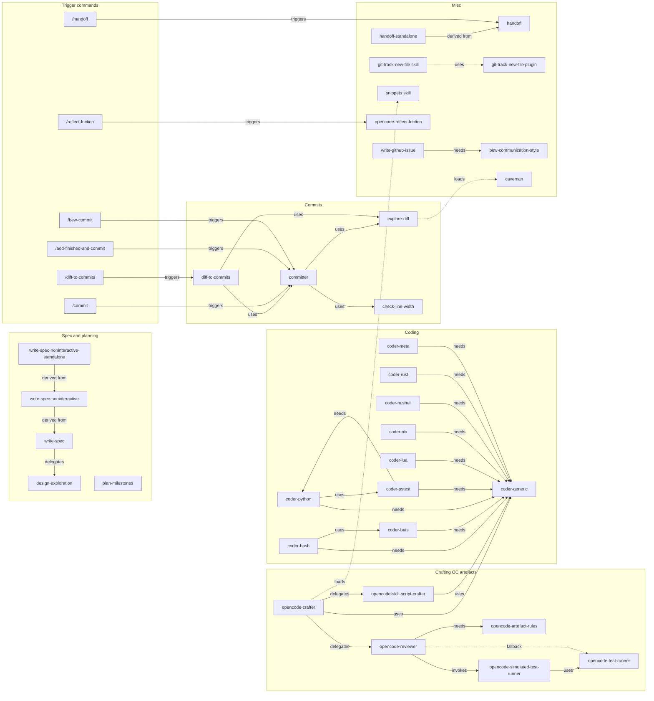

# MY_AI_STUFF

Catalogue of every OpenCode skill, agent, command, and plugin in my config, grouped by topic then the rest 🚀

> [!NOTE]
> A dependency graph of the complex skills is at the end.

## Crafting OC artefacts

- Skill `opencode-crafter` (multi-phased, has script) — Creates, updates, and refactors any OC artefact: skills, agents, commands, oc-tools, oc-plugins, snippets.

  - Full lifecycle: Classify → Discover → Draft → (Scripts) → Review → Ship, then (PropagateChange) when variants exist.
  - Delegates review to `opencode-reviewer` and script drafting to `opencode-skill-script-crafter`.
  - Pulls in `coder-generic` + a matching `coder-*` skill for script writing as needed, and the `snippets` spec for snippet work.
  - Can derives a standalone (single-file, tool-less) skill variant on request.
  - Can take inspiration from an existing skill (e.g. from a Github URL).

- Agent `opencode-reviewer` — Refines a draft OC artefact through focused user feedback; applies trivial edits directly and iterates with you on the rest.

  Invoked by `opencode-crafter` at `Phase:Review` to find gaps and iterate with the user.

- Skill `opencode-artefact-rules` — Quality criteria and review checklist for OC artefacts, one reference per type.

  Used for `opencode-reviewer`'s `Phase:Review` — the reviewer loads it to check every criterion for the artefact type.

- Agent `opencode-simulated-test-runner` — Runs an isolated simulated test on a draft artefact.

  Invoked by `opencode-reviewer` at `Phase:Testing` (structural changes only), with no prior review context.

- Skill `opencode-test-runner` — Dry-run testing instructions: generate test cases, narrate them, iterate with reviewer on failures.

  Used for `opencode-simulated-test-runner`'s test pass (entered from `opencode-reviewer`'s `Phase:Testing`) — runs isolated simulated tests on a draft.

- Agent `opencode-skill-script-crafter` — Drafts, tests, and iterates on a skill's scripts.

  Invoked by `opencode-crafter` at `Phase:Scripts` (when needed) to POC and harden scripts in isolation.

- Plugin `opencode-snippets` — Hashtag-based snippet expansion (`#snippet`), with shell substitution, includes, forms, and skill rendering.

  Loaded by `opencode-crafter` for snippet work (the `snippets` spec).

## Coding

- Skill `coder-generic` — General code rules for any language: structure, naming, types, comments, error handling.

  - Splits into `module-rules.md` (imported code) and `script-rules.md` (standalone executables).
  - Loaded before any language skill; every `coder-<lang>` requires it.

- Skills by language/tech: `coder-bash`, `coder-bats`, `coder-python`, `coder-pytest`, `coder-lua`, `coder-nix`, `coder-nushell`, `coder-rust`.

- Skill `coder-meta` — Rules for writing new `coder-<lang>` skills.

## Specs & planning

- Skill `write-spec` (multi-phased, has script) — Interactive methodology for drafting and refining specs, design docs, architecture notes, RFCs.

  - Phases: Discover → Explore (optional) → Draft → Review.
  - Delegates deep, pre-spec design maturation to `design-exploration`.

  Variants:
  * `write-spec-noninteractive` — non-interactive pass for tool-less chat contexts; no phase gates, questions batched at the end.
  * `write-spec-noninteractive-standalone` — self-contained (inlined) variant of the non-interactive one.

- Skill `design-exploration` (multi-phased) — Methodology for maturing a design before a spec exists.

  - Phases: Setup → Explore → Wrap.
  - Runs in single-topic or multi-topic mode.

  Used for `write-spec`'s optional `Phase:Explore` when the design is genuinely uncertain.

- Skill `plan-milestones` (multi-phased) — Plans, creates, and refines project milestones (`MILESTONES.md`).

  - Phases: Discover → Draft → Discuss → Finalize.

## Commits

- Skill `committer` (multi-phased) — Drafts a commit message from a diff, only when explicitly asked.

  - Phases: Setup → Analyse → Style → Draft → Commit.
  - Routes diff analysis through `explore-diff`; wraps with `check-line-width`.
  - Iterates the message with you, offering subject/body refinement suggestions.

- Skill `diff-to-commits` (multi-phased) — Interactive process to splits a diff (default to unstaged changes) into logical commits and drafts each message with user, one group at a time.

  - Phases: Explore → Group → Draft → Summary.
  - Uses `explore-diff` for analysis, then the `committer` skill for each message.

- Skill `check-line-width` (has script) — Checks line length / column overflow from a file or stdin; the only authority on wrapping.

  Used explicitly by `committer` to validate message wrapping, and relied on implicitly by `opencode-crafter` / `opencode-reviewer` when writing or reviewing artefacts (via `coder-generic`'s line-width rule).

- Agent `explore-diff` — Generic diff/patch explorer; defaults to a summary of concerns, but can be driven to return any structure the caller asks for.

  Used explicitly by `committer` (`Phase:Analyse`) and `diff-to-commits` (`Phase:Explore`) to analyse a diff without polluting shared context.

- Command `/commit` — **triggers `committer`**.
- Command `/bew-commit` — **triggers `committer`** (duplicate, useful when `/commit` is hijacked by a repo).
- Command `/add-finished-and-commit` — **triggers `committer`**: draft a commit for the task just finished, scoped to its files.
- Command `/diff-to-commits` — **triggers `diff-to-commits`**.

## Handoff & session

- Skill `handoff` — Produces a structured handoff document from the session so another agent or human can continue in a fresh session.

  Variants:
  * `handoff-standalone` — self-contained, tool-less variant; skill refs become plain recommendations.

- Command `/handoff` — **triggers `handoff`**.

- Skill `opencode-reflect-friction` — Reviews session friction (main conversation + subagents) and suggests artefact improvements; only on explicit request.

- Command `/reflect-friction` — **triggers `opencode-reflect-friction`**.

## Writing & issues

- Skill `bew-communication-style` — Style reference for writing prose in bew's voice (PRs, issues, posts, emails, chat).
- Skill `bew-inline-callout-style` — Convention for inline callout markers in prose and artefact files; reference-only.
- Skill `write-github-issue` — Guidelines for drafting a GitHub issue in bew's voice.

  Uses `bew-communication-style` for voice and tone.

- Skill `caveman` — Compressed communication mode; ~75% fewer tokens, full technical accuracy.

## Other Skills

- `agent-blocker` — Load on environment/runtime hard errors (missing command, version mismatch, permission/auth failure, unreachable network, independently broken tests, failed tool/subagent launch).
- `agent-stuck` — Load when a human decision or strategy change is needed; track consecutive identical failures, load at the third.
- `gh-read-file` — Read one explicitly referenced file from GitHub via the authenticated `gh` CLI.
- `git-track-new-file` — Load right after creating a file/dir so the `git_track_new_file` tool git-tracks it; companion to the local `git-track-new-file` plugin.
- `incremental-write` — Write structured files incrementally: skeleton first, then targeted edits per section.
- `karpathy-guidelines` — Behavioral guidelines to avoid overcomplication, keep changes surgical, surface assumptions.
- `read-man-page` (has script) — Token-efficient incremental man page reading via its `manq` script.
- `text-replace` — Bulk/mechanical search & replace and renames across files using `sd`; supports literal or regex.

## Other Commands

- `/why-you` — Reflect on the root cause of a decision, without acting.
- `/retitle` — Auto-retitle the current session from the conversation.
- `/dcp-compress-aggressive` — Aggressively shrink context by collapsing blocks into one lean summary.
- `/smarter-take-over-for-better-suggestions` — A smarter model takes over after a weaker model's suggestions.

## Other Plugins

- `git-track-new-file` (local) — Registers the `git_track_new_file` tool, which runs `git add -N` on new files/dirs, skipping gitignored paths, secrets, and `/tmp`.

  Companion skill `git-track-new-file` tells the agent when to call it.

## Important third-party plugins

- `@tarquinen/opencode-dcp` (package) — Dynamic Context Pruning: manages context to optimize tokens for long sessions.
- `opencode-snippets` (package) — Hashtag-based snippet expansion (`#snippet`); used heavily.

## Dotfiles-specific skills

Skills scoped to this dotfiles repo (under `<repo>/.agents/skills/`), not the global config:

- Skill `coder-lua-for-nvim` — Neovim Lua conventions for this repo's `nvim/lua/**`; requires `coder-generic` + `coder-lua`.
- Skill `nvim-plugin-dev` (has script) — Neovim plugin authoring under `nvim-myplugins/`; requires `coder-generic`, `coder-lua`, `coder-lua-for-nvim`.
- Skill `read-nvim-help` (has script) — Token-efficient incremental Neovim/Vim help reading via its `nvimq` script.

No dotfiles-specific agents or commands exist yet.

## Dependency graph

Not a full view of the catalogue — only the complex skills and their direct dependencies are shown.

