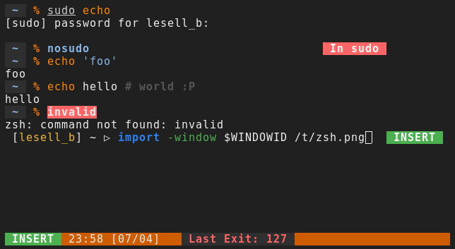

# ConfigZsh

My personnal zsh config

## Screenshot



## Installation

### clone

```sh
cd ~/.config && git clone --recursive git@github.com:bew/configzsh.git zsh
```

### place config files

```sh
ln -s ~/.config/zsh ~/.zsh
ln -s ~/.zsh/zshenv ~/.zshenv
ln -s ~/.zsh/zshrc ~/.zshrc
ln -s ~/.zsh/zlogin ~/.zlogin
```

---

#### level 4
##### level 5
###### level 6
